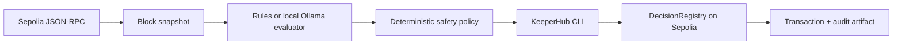

# ProofPulse — KeeperHub Agents Onchain

ProofPulse is a zero-principal AI agent that observes EVM chain health, classifies the latest conditions, and records a tamper-evident decision through KeeperHub. It never transfers tokens, grants approvals, trades, deposits, stakes, or sends native value.

The project targets the KeeperHub Agents Onchain hackathon's core requirement: the agent must land a real transaction through KeeperHub rather than mock execution.

## Why it is safe to demo

- Sepolia is the default and mainnet is blocked unless `ALLOW_MAINNET=true` is set explicitly.
- The only executable method is `DecisionRegistry.recordDecision(...)`.
- The registry method is non-payable and the CLI invocation has no value flag.
- `DRY_RUN=true` is the default.
- Automatic anomaly writes are disabled unless `AUTO_RECORD=true` is explicitly set.
- The rules evaluator has no API cost. Optional Ollama support keeps AI inference local.
- Every decision produces a local JSON artifact containing the evidence hash and any transaction hash returned by KeeperHub.
- RPC chain IDs and deployed contract bytecode are verified, network/model calls have finite timeouts, and failed KeeperHub executions are preserved as audit artifacts.

## Architecture



## Prerequisites

- Node.js 20 or newer
- A free KeeperHub account and authenticated `kh` CLI
- A deployed `DecisionRegistry` address on Sepolia
- A Sepolia RPC endpoint

KeeperHub CLI authentication can be interactive:

```bash
kh auth login
kh auth status
```

For CI, create an organisation API key in KeeperHub and provide `KH_API_KEY` through the environment. Never save it in this repository.

## Setup

```bash
cp .env.example .env
```

Load the values using your preferred environment manager. At minimum, set `CONTRACT_ADDRESS` after deploying `contracts/DecisionRegistry.sol` on Sepolia. Do not substitute an unverified address.

Run all local checks:

```bash
npm run check
node scripts/verify-environment.mjs
```

Preview the exact KeeperHub call without submitting it:

```bash
set -a
source .env
set +a
npm run demo
```

The output must show `execution.mode` as `dry-run`. Review its chain, contract, method, arguments, and `snapshot.contractCodeSha256`. Copy that reviewed hash into `EXPECTED_CONTRACT_CODE_SHA256` in `.env`; live mode refuses to run without it and rejects changed bytecode.

## One controlled live transaction

Only after the dry run is correct and the KeeperHub free gas allowance is confirmed:

```bash
DRY_RUN=false FORCE_RECORD=true npm start
```

This is the only command in the project that authorizes a chain write. It calls the fixed non-payable registry method and waits for confirmation. A run artifact is saved under `artifacts/` and is ignored by Git.

For unattended anomaly recording, `AUTO_RECORD=true` must be set separately. Keep it false for the one-transaction hackathon demo so a degraded RPC cannot cause repeated writes. Repeating the same observed block uses the same onchain run ID and reverts rather than creating duplicate records.

## AI modes

The default mode is deterministic and free:

```bash
EVALUATOR_MODE=rules npm start
```

For a local language-model decision, install Ollama separately, pull the configured model, then run:

```bash
EVALUATOR_MODE=ollama OLLAMA_MODEL=qwen3:4b npm start
```

The local model can classify and explain conditions but cannot choose a destination, method, value, or chain. Those fields remain fixed by the policy layer. The deterministic evaluator is also run in Ollama mode, and the model cannot downgrade a deterministic degraded or critical result.

## Submission evidence checklist

- Public source repository
- Short demo video showing input, decision, KeeperHub execution log, explorer transaction, and registry state
- Transaction link and KeeperHub execution ID
- Exported KeeperHub workflow or CLI execution log
- Architecture and safety explanation
- Explicit statement that no user principal is transferred

See `SUBMISSION.md` for the draft submission copy and `SECURITY.md` for the threat model.
